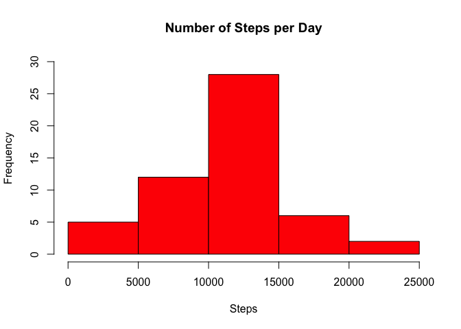
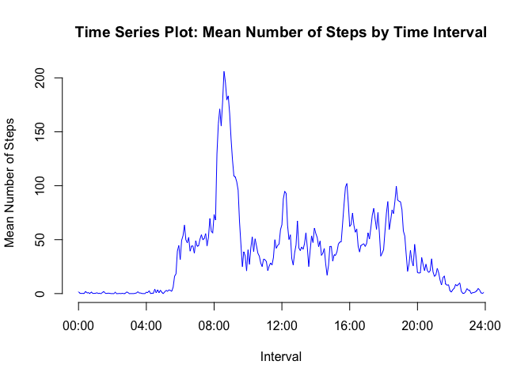
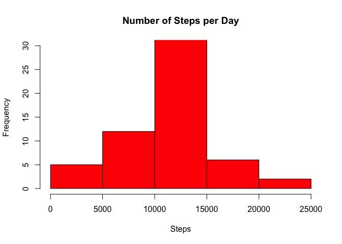
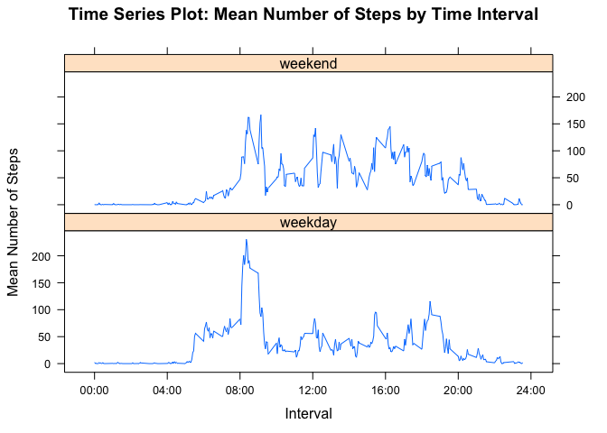

# Reproducible Research: Peer Assessment 1

##Loading and preprocessing the data
Prior to loading the data, set the working directory and load the libraries that will be needed for the assignment.


```r
setwd("~/Documents/R Working Directory/ReproducibleAssignment1")
library(dplyr)
library(lattice)
```

The data are read into a data frame using the `read.csv()` method.


```r
activity<-read.csv("activity.csv")
```

##What is mean total number of steps taken per day?

Prior to summarizing the number of steps per day, I independently confirmed that when steps data are missing (`NA`), the entire day of measurements is missing.  This is useful to know in case some of the summary numbers are based on partial day data.  For the purpose of this step, missing values  will be ignored in all summary calculations _as implemented by the `na.omit=TRUE` or `na.rm=TRUE` parameter of the relevant functions_.

####1. Calculate the total number of steps taken per day
Calculating the total number of steps per day is simple using the `dplyr` package.  Data are first grouped by the day and a data frame is constructed containing summary data.  Because the data are grouped, the sum function can be used to calculate the total by those groups.


```r
activity <- group_by(activity, date)
stepsPerDay<-summarize(activity, dailySteps = sum(steps, na.omit = TRUE))
```

To show this worked, the first few lines of the resulting data frame is shown below:


```r
head(stepsPerDay,10)
```

```
## Source: local data frame [10 x 2]
## 
##          date dailySteps
## 1  2012-10-01         NA
## 2  2012-10-02        127
## 3  2012-10-03      11353
## 4  2012-10-04      12117
## 5  2012-10-05      13295
## 6  2012-10-06      15421
## 7  2012-10-07      11016
## 8  2012-10-08         NA
## 9  2012-10-09      12812
## 10 2012-10-10       9901
```

####2. Make a histogram of the total number of steps taken each day

A histogram is created using R base graphics below:


```r
hist(stepsPerDay$dailySteps,main="Number of Steps per Day",
     xlab="Steps",col = "red",breaks=6,ylim = c(0, 30))
```

 

####3. Calculate and report the mean and median of the total number of steps taken per day

The mean and median values (as well as additional quantiles) for the number of steps taken per day are included in the output of the `summary` function.


```r
summary(stepsPerDay$dailySteps)
```

```
##    Min. 1st Qu.  Median    Mean 3rd Qu.    Max.    NA's 
##      42    8842   10770   10770   13300   21200       8
```

## What is the average daily activity pattern?

####1. Make a time series plot (i.e. `type = "l"` ) of the 5-minute interval (x-axis) and the average number of steps taken, averaged across all days (y-axis)

To begin, the data must be grouped by interval for the `dplyr` package to be used in summarizing the data.  After grouping, the mean number of steps for each interval is calculated and placed in a new data frame.


```r
activity <- group_by(activity, interval)
stepsPerInterval<-summarize(activity, meanIntervalSteps = mean(steps, na.rm = TRUE))
```

Each interval corresponds to a military time in 5 minute increments and there are 288 intervals in a given day. Two vectors are created to provide meaningful labels for the plot.  The first contains labels for every 4 hours and the second represents which intervals align with the time labels.  `rownames()` is used for the x-axis in order to keep the spacing between intervals uniform (e.g. there are no valid times associated with intervals 60 through 95). The resulting time series plot is shown below:


```r
intLabels <- c("00:00","04:00","08:00","12:00","16:00","20:00","24:00")
intList <- c(1,49,97,145,193,241,289)
plot.ts(x=rownames(stepsPerInterval),y=stepsPerInterval$meanIntervalSteps,
      type="l", col = "blue", xlab="Interval", ylab="Mean Number of Steps",
      main = "Time Series Plot: Mean Number of Steps by Time Interval",axes = FALSE)
axis(side=2)
axis(side=1, labels=intLabels, at=intList)
```

 

####2. Which 5-minute interval, on average across all the days in the dataset, contains the maximum number of steps?

With the `dplyr` package already available, the appropriate row can be selected using the `filter()` function.


```r
m <- max(stepsPerInterval$meanIntervalSteps)
maxStepsPerInterval <- filter(stepsPerInterval, meanIntervalSteps==m)
print(maxStepsPerInterval)
```

```
## Source: local data frame [1 x 2]
## 
##   interval meanIntervalSteps
## 1      835          206.1698
```

## Imputing missing values

Note that there are a number of days/intervals where there are missing values (coded as `NA` ). The presence of missing days may introduce bias into some calculations or summaries of the data.

####1. Calculate and report the total number of missing values in the dataset (i.e. the total number of rows with NA's)

The logical vector `i` indicates which rows of the data set are not complete cases (i.e. have at least one variable coded as `NA`).  An array `incomplete` is created by trimming just to records meeting the `TRUE` condition from vector `i`.  From here, the number of incomplete cases is counted using the `nrow()` function.


```r
i <- !complete.cases(activity)
incomplete <- as.array(which(i))
nrow(incomplete)
```

```
## [1] 2304
```

####2. Devise a strategy for filling in all of the missing values in the dataset. The strategy does not need to be sophisticated. For example, you could use the mean/median for that day, or the mean for that 5- minute interval, etc.

A sensible approach to imputing missing steps data is to apply the mean number of steps as calculated using complete cases for each interval.  A new data frame will be constructed by merging the original `activity` data frame with the `stepsPerInterval` data frame created above.


```r
activityImputed <- merge(activity,stepsPerInterval,by.x = "interval",by.y = "interval",all=TRUE)
activityImputed <- arrange(activityImputed, date, interval)
```

####3. Create a new dataset that is equal to the original dataset but with the missing data filled in.

The cases with missing data are already contained in logical vector `i`.  The missing data are filled in for the subset of records where the indices of this vector are `TRUE`. 


```r
activityImputed$steps[i==TRUE]<-activityImputed$meanIntervalSteps[i==TRUE]
```

To confirm the data have been filled in where missing, a logical vector of the complete cases for the `activityImputed` data frame is created and summarized.


```r
cc<-complete.cases(activityImputed)
summary(cc)
```

```
##    Mode    TRUE    NA's 
## logical   17568       0
```

####4. Make a histogram of the total number of steps taken each day and calculate and report the mean and median total number of steps taken per day. Do these values differ from the estimates from the first part of the assignment? What is the impact of imputing missing data on the estimates of the total daily number of steps?

To make a histogram as well as calculate the mean and median of the total steps taken per day, code shown above will be modified to use the `activityImputed` data frame.  The modified code shown here creates updated output below. 


```r
activityImputed <- group_by(activityImputed, date)
stepsPerDayImputed<-summarize(activityImputed, dailySteps = sum(steps, na.rm = TRUE))
hist(stepsPerDayImputed$dailySteps,main="Number of Steps per Day",
     xlab="Steps",col = "red",breaks=6,ylim = c(0, 30))
```

 

```r
summary(stepsPerDayImputed$dailySteps)
```

```
##    Min. 1st Qu.  Median    Mean 3rd Qu.    Max. 
##      41    9819   10770   10770   12810   21190
```

The values shown here differ slightly from those reported using the non-imputed data, however, not by much.  The imputation method chosen here filled in 8 days of measurements based on interval measurements for 53 days with complete data.  Because mean values were used, the overall distribution and measures of central tendency were not expected to change much, though a complete data set is now available for additional analyses.

## Are there differences in activity patterns between weekdays and weekends?

For this part the weekdays() function may be of some help here. Use the dataset with the filled-in missing values for this part.

####1. Create a new factor variable in the dataset with two levels - "weekday"" and "weekend"" indicating whether a given date is a weekday or weekend day.

In order to determine if a given date falls on a weekday or weekend, the factor variable must be expressed as a POSIX value.  This can then be formatted to display the day of the week associated with the date (`"%w"` represents Decimal Weekday (0=Sunday)).  This value is then used to generate a factor variable using the `ifelse()` control structure.


```r
activityImputed$DayOfWeek<-format(as.POSIXct(activityImputed$date), format="%w")
activityImputed$Weekday<-ifelse(activityImputed$DayOfWeek %in% c("0","6"),"weekend","weekday")
```

####2. Make a panel plot containing a time series plot (i.e. `type = "l"` ) of the 5-minute interval (x-axis) and the average number of steps taken, averaged across all weekday days or weekend days (y-axis).

In order to plot the average number of steps by weekdays and weekends in separate panel plots, the data frame needs to be regrouped so the calculation of the mean for each interval accounts for the type of day.


```r
activityImputed <- group_by(activityImputed, interval,Weekday)
stepsPerIntervalImputed<-summarize(activityImputed, meanIntervalSteps = mean(steps, na.rm = TRUE))
```

The `lattice` package is used to make time series plots with weekday and weekend intervals appearing in separate panels.  Once again, two vectors are used to create labels for the intervals that correspond to the time of day (military time).


```r
intLabels <- c("00:00","04:00","08:00","12:00","16:00","20:00","24:00")
intList <- c(0,400,800,1200,1600,2000,2400)
xyplot(meanIntervalSteps ~ interval | Weekday, 
      data = stepsPerIntervalImputed, layout = c(1, 2),
      type="l", xlab="Interval", ylab="Mean Number of Steps",
      main = "Time Series Plot: Mean Number of Steps by Time Interval",
      scales=list(x=list(at=intList, labels=intLabels)))
```

 

